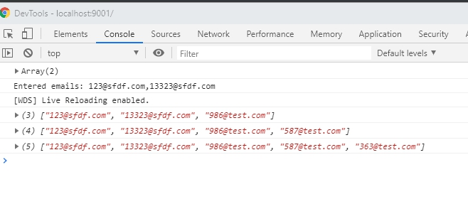

Email input component
------------------------------

[](https://travis-ci.org/github/jegius/frontend-test-assessment)


This is email input component. You can use it for get emails from user input. This component can:

- Receive email from parent component and display it on page.
- Give data from component and set it to parent.
- Give subscription on all email changes.
- User can add/edit/paste emails in component, also he can get email counter.
- Component have localization on two languages Russian and English. User can split it with use locale button.
- User can add random email to form.

Get started
------------------------------

For work with application you need node.js

Before application start you should run `npm i` command from root application folder.

For view DEMO you can clone this repository: 

- start application locally: `npm run start`
- build component: `npm run build`
- build component with prod configuration: `npm run build:prod`
- build types: `npm run build:types`
- run tests: `npm run test`


How add component to my page?
-----------------------------

For using this component you need create it like simple javascript object, 
 provide inside parent html element and call `render` method: 

```typescript
const HOST_CLASS: string = '.host__container';
const host: HTMLElement = window.document.querySelector(HOST_CLASS);

const emailApi: ComponentApi = new EmailInputComponent(host).render();
```

You can create few component on same page. All components can work independently: 

```typescript
const HOST_CLASS: string = '.host__container';
const host: HTMLElement = window.document.querySelector(HOST_CLASS);

const emailApi: ComponentApi = new EmailInputComponent(host).render();
const secondEmailApi: ComponentApi = new EmailInputComponent(host).render();
```

But you can provide custom `localization` and `email` services, if you need bind components with
each other. 

 ## Default EmailInputComponent constructor.

```typescript
 constructor(
        private readonly host: HTMLElement,
        private readonly document: Document = window.document,
        private readonly localizationService: LocalizationService = new LocalizationServiceImplementation(),
        private readonly emailService: EmailService = new EmailServiceImplementation(),
    ) 
```

For correct work this services should extend `EmailService` and `LocalizationService` 
abstract objects.

Method render will return component api with same interface:

```typescript
export interface ComponentApi {
    getEnteredEmails(): string[];

    setEmails(emails: string[]): void;

    subscribeOnChanges(callback: (emails: string[]) => void): Subscription;
}
```

With using this interface you can:

- Get current entered emails with using `getEnteredEmails` method.
- Provide and rewrite all emails with using `setEmails` method. 

```typescript
const HOST_CLASS: string = '.host__container';
const host: HTMLElement = window.document.querySelector(HOST_CLASS);

const emailApi: ComponentApi = new EmailInputComponent(host).render();
emailApi.setEmails(['123@sfdf.com', '13323@sfdf.com']);
```

All provided emails will display in component:
 


- Subscribe on email changes with using `subscribeOnChanges` method. 

```typescript
const HOST_CLASS: string = '.host__container';
const host: HTMLElement = window.document.querySelector(HOST_CLASS);

const emailApi: ComponentApi = new EmailInputComponent(host).render();

const emailSubscription: Subscription = emailApi
    .subscribeOnChanges((emails: string[]) => console.log(emails));
```
 ## Subscription changes: 


This method will return instance of Subscription object. 

```typescript
export class Subscription {
    private subscriptionNumber: number;

    constructor(
        private readonly subscriptions: Subscription[],
        public readonly callback: (emails: string[]) => void,
    ) {
        this.subscriptionNumber = subscriptions.length;
    }

    unsubscribe(): void {
        this.subscriptions.splice(this.subscriptionNumber, 1);
    }
}
``` 

With use it object you can unsubscribe from email changes with using `unsubscribe` method.

```typescript

const HOST_CLASS: string = '.host__container';
const host: HTMLElement = window.document.querySelector(HOST_CLASS);

const emailApi: ComponentApi = new EmailInputComponent(host).render();


const emailSubscription: Subscription = emailApi
    .subscribeOnChanges((emails: string[]) => console.log(emails));

emailSubscription.unsubscribe();

```

User gide:
---------------

 You can create new email input with using `add more people...` button.


After click on this button will create email input. This input have a validation of email.
If email is valid you will see email input as you see in this picture:


also if email is invalid you will see this: 


You can use ENTER and COMMA button for add email from current input value in component and
crate new input for new email. Use BACKSPACE button for remove last email from `email-input`
component. Also you can paste email inside the component, and that emails will set inside it.

`Add email` button will add new random email inside the component. 

`Get emails cound` button will return common email counter.

`RU\EN` button can change current localization. (In current state available two locales Russian and English)
